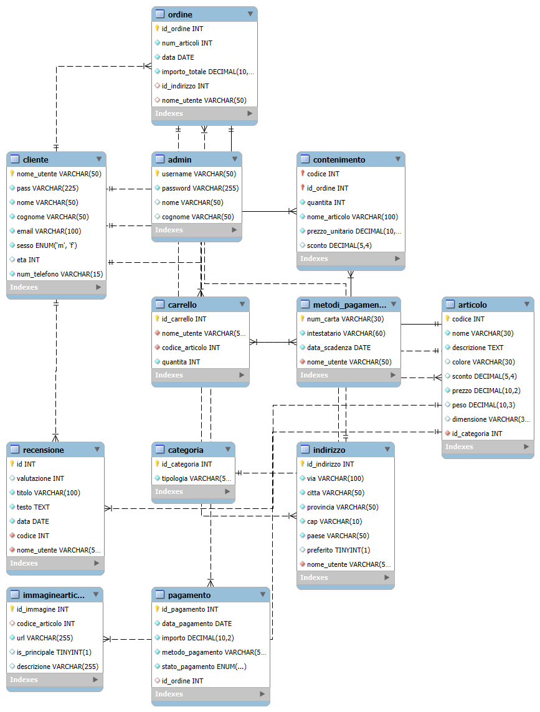

# 🗄️ ReVamp Ascent | Enterprise Database Solutions
> **Architettura Relazionale per E-commerce di Design**

Benvenuti nella repository del database **ReVamp Ascent**. Questo progetto presenta l'architettura di un database relazionale professionale, progettato per una moderna piattaforma e-commerce di arredamento (ispirata al modello IKEA).

Il progetto si focalizza sull'**integrità dei dati**, l'implementazione di **logiche di business** tramite vincoli SQL e l'**analisi dei dati** per il decision-making.

---

## 🚀 Panoramica
L'obiettivo di questo progetto è dimostrare la progettazione di un database scalabile capace di gestire operazioni e-commerce complesse: dalla gestione utenti e cataloghi multi-categoria, fino al tracciamento sicuro di ordini e pagamenti.

### Funzionalità Chiave:
* **Gestione Utenti:** Ruoli distinti per Clienti e Amministratori con gestione sicura delle credenziali.
* **Catalogo Dinamico:** Supporto per categorie, gallerie immagini multiple e gestione in tempo reale di scorte e sconti.
* **Flusso d'Acquisto:** Sistema integrato di Carrello e Ordini con tracciamento dettagliato.
* **Integrità dei Dati:** Implementazione completa di Foreign Key con azioni a cascata e vincoli `CHECK` personalizzati.

---

## 📊 Schema Concettuale (Diagramma ER)
Il database segue un modello relazionale normalizzato per garantire l'assenza di ridondanza dei dati.

---

## 📁 Struttura della Repository

| Cartella | Descrizione |
| :--- | :--- |
| [**`/code`**](./code) | Contiene `schema.sql` (struttura), `population.sql` (dati di test) e `queries.sql` (analisi). |
| [**`/documentation`**](./documentation) | Include il **Diagramma ER**, lo **Schema Logico** e la documentazione tecnica. |
| **`README.md`** | Questo file (Presentazione del progetto). |

---

## 🛠️ Highlights Tecnici

### 1. Integrità e Vincoli
* **Validazione:** Utilizzo di vincoli `CHECK` per garantire che le valutazioni siano tra 1-5 e i prezzi sempre positivi.
* **Sicurezza:** Struttura predisposta per l'hashing delle password (SHA-512) per un approccio security-first.
* **Relazioni:** Uso estensivo di `ON DELETE CASCADE` e `ON UPDATE CASCADE` per mantenere l'integrità referenziale automaticamente.

### 2. Query Analitiche
Il file [`queries.sql`](./code/queries.sql) contiene logiche SQL avanzate per ottenere insight di business, tra cui:
* **Analisi del Fatturato:** Vendite totali raggruppate per categoria di prodotto.
* **Fedeltà Clienti:** Identificazione dei "Top Spenders" tramite clausole `HAVING` e `SUM`.
* **Analisi Interesse:** Monitoraggio dei prodotti più presenti nei carrelli per prevedere la domanda.

---

## 🏗️ Come Utilizzare il Progetto
Per replicare l'ambiente localmente:

1.  **Clona la repo:** `git clone https://github.com/tuo-username/Furniture-Ecommerce-DB.git`
2.  **Crea lo Schema:** Esegui `code/schema.sql` nel tuo MySQL Workbench o CLI.
3.  **Popola i Dati:** Esegui `code/population.sql` per importare prodotti, utenti e ordini di esempio.
4.  **Testa le Query:** Utilizza `code/queries.sql` per vedere il database in azione.

---

## 📋 Schema Logico (Sintesi)
Riferimento testuale rapido della struttura relazionale:

* **Cliente** (**nome_utente** [PK], email, nome, cognome, ...)
* **Articolo** (**codice** [PK], nome, prezzo, *id_categoria* [FK], ...)
* **Ordine** (**id_ordine** [PK], data, *nome_utente* [FK], ...)
* *(Dettagli completi disponibili in [LOGICAL_SCHEMA.md](./documentation/SchemaLogico.md))*

---

### 🖋️ Autore
Antonio Aliberti *Studente di Informatica*
